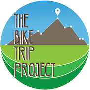

# THE BIKE TRIP PROJECT

Visit the official website [here](http://www.thebiketripproject.com).

This is a repository created to hold the content of the bike trip project. The main content will include:    
>* A **docs/** folder for hosting the main webpage of the project.

>* A **data_manging/** folder to hold the data analysis part of the project including metrics, etc.

>* A **d3_visualizations/** folder for testing the D3 visualizations in a bl.ocks format before merging into the main webpage.

>* A **custom_app/** folder to hold the content of the Android app built especially for the purposes of this project.

You may check the **Wiki** tab for documentation.

